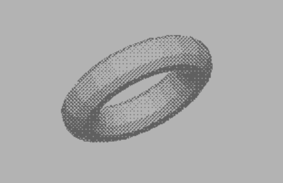

Objconv
=======

**Objconv is Giga-CAD Plus 3D object converter to Wavefront OBJ**

[Giga-CAD Plus](https://github.com/mrjoso/giga-cad-obj/blob/master/photos/gigac_version.png) is the forgotten treasure of the C64 3D creation software.
It was released in 1986 by Markt & Technik publisher with book title "3D-Konstruktion mit GIGA-CAD Plus auf dem C64/C128" ISBN 3-89090-409-2.
And updated in 1988 in "C64/C128 Objekt-Bibliotheken zu GIGA-CAD Plus" ISBN 3-89090-581-1.
It enables you to create mesh objects, render the scene and create films.
Once you know how to use it, you would never go back to your current 3D creation software. :-)       

The objconv tool was created with [3D printing](https://github.com/mrjoso/giga-cad-obj/blob/master/photos/canon-obj.jpg) in mind. There are only few steps to 3D print your designs created in Giga-CAD Plus.
Original idea was to create STL converter, but later was changed to more simple solution which enables you to import the 3D mesh object 
to any suitable software for 3D editing and STL conversion e.g. MeshLab, Netfabb Basic, 3D Builder, Blender etc.   
You need to convert the Giga-CAD Plus object file to file format which is known to that tools.
I have chosen the output format Wavefront OBJ file.

*Be warned, the objconv is simple console application*

## Installation

 * For Windows users the tool comes precompiled, just copy the objconv.exe to your working folder 
 * Compile in Linux using:
```bash
gcc objconv.c -o objconv
```
 * Cross compilation under cc65 for C64 would require to avoid float variables

## Usage

 * objconv.exe ob.inputfile.seq [outputfile]
 * If there is no outputfile name, object.obj is created

## Limitations (Known Issues)

 * If the original object contain polygon with hole or multipolygon the bridge edge is created and is added to the same face definition.
Giga-CAD Plus does not differentiate inner and outer rings so this solution has problems and may produce incorrect faces (self intersecting etc.), fixing the object is necessary any way
 * The surface geometry need to be "watertight" to be 3D printable
 * Giga-CAD Plus does not handle face orientation (face normals), you need to flip the faces to the right direction
 * The X axis of the whole object is flipped against the display view in Giga-CAD Plus screen 

## Test

 * The repository contain test object [ob.torus-10-20.seq](test/ob.torus-10-20.seq) created in Giga-CAD Plus to test the converter.


## Other solutions

I have just found another project, this time in Python

https://github.com/JensRestemeier/ConvertGigaCadPlus

---

*If you like the tool, please let me know about your experience. You can find the contact in the source code*
